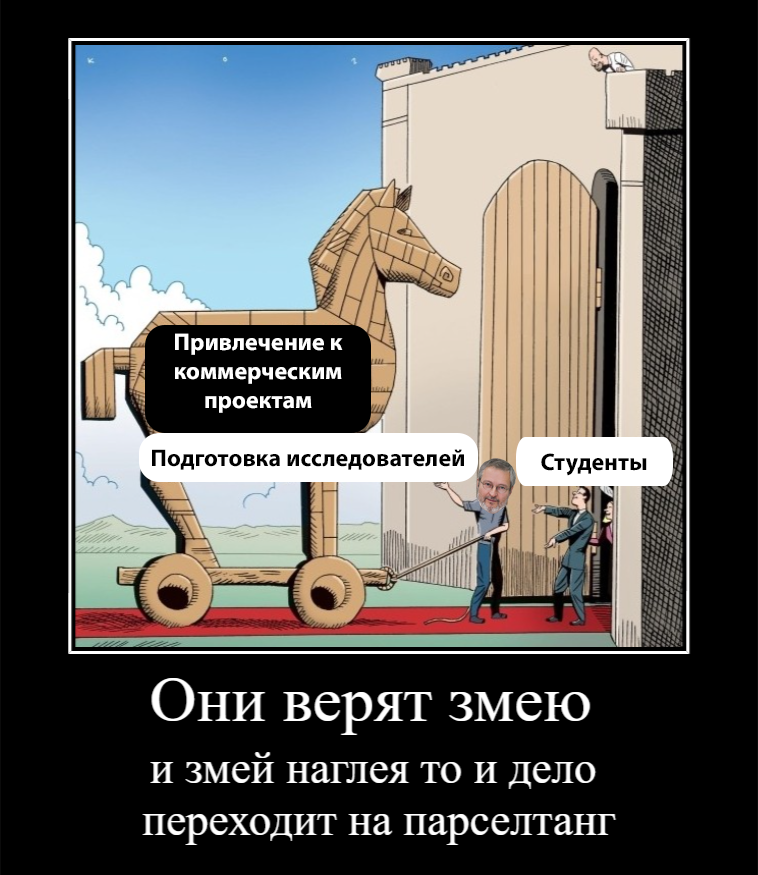
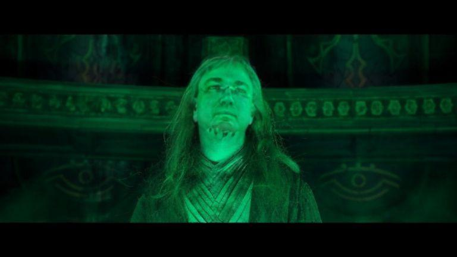

### ✨ Цель и задача отзывов

- Цель: сделать так, чтобы хорошие люди меньше ошибались
    - Ошибка: решение, которое меняется, когда неопределённости становится меньше
        - Задача: уменьшить неопределённость при выборе образовательной и дальнейшей трудовой траектории

### ⚜️ <a id="reviews">Отзывы</a>

- [13 февраля 2024 — Колосов Алексей Михайлович, выпускник '16, '19 и '23](#review1)

- [14 февраля 2024 — анонимно, выпускник '21](#review2)

- [18 февраля 2024 — анонимно, выпускники '16](#review3)

    - [18 февраля 2024 — комментарий одного из авторов отзыва](#review31)

- [22 февраля 2024 — Колосов Алексей Михайлович, увольнение с ВМК](#review4)

- [25 февраля 2024 — Шмитов Максим Олегович, выпускник '22](#review5)  

- [Оставить свой отзыв](#reviewnew)

На этой странице публикуются самые интересные и полезные отзывы выпускников ВМК. Пунктуация и орфография авторов сохранены. Дата в заголовке отзыва это дата добавления отзыва на эту страницу.

#### <a id="review1">13 февраля 2024 — Колосов Алексей Михайлович, выпускник '16, '19 и '23</a>

> 

Я считаю, что обучение на кафедре АСВК под научным руководством Руслана Леонидовича Смелянского с осени 2014 года по 25 декабря 2020 года было ошибкой, поскольку привело к замедлению моего развития, последствия которого я ощущаю до сих пор. Замедление развития связано с тем, что вместо подготовки исследователей кафедра АСВК занимается привлечением учащихся к коммерческим проектам. Как можно видеть по [статистике научных публикаций](https://istina.msu.ru/statistics/organization/214524/dynamic/) у кафедры АСВК за период 2015-2024 всего 5 публикаций в журналах из топ-25 (у лидеров рейтинга более 130).

Кроме того, я на личном примере убедился в том, что после завершения обучения на кафедре АСВК есть трудности с трудоустройством на исследовательскую позицию по полученной на кафедре специальности: по итогам общения с компанией Хуавей я получил отзыв о том, что не умею проводить исследования. То, что причина связана с кафедрой АСВК, подтверждается тем, что после перехода на кафедру ММП я в результате [стал исследователем](https://vk.com/@cmcmsu-kem-rabotaut-posle-vmk) в компании Хуавей по своей новой специальности (искусственный интеллект и машинное обучение).

Для тех, кого не смущает ширма подготовки исследователей и кто внутренне заинтересован именно в участии в коммерческих проектах кафедры АСВК, могу сказать, что за 5 лет участия в этих коммерческих проектах моя зарплата не превышала 50 тыс.руб, а зарплата, с которой я начал работать в Хуавее, составила 150 тыс.руб. и через год достигла 250 тыс.руб. *Подробнее о связи между выбранной кафедрой и зарплатой через несколько лет после выпуска скоро можно будет узнать из результатов зарплатного опроса для обучающихся и выпускников.*

Также важно иметь ввиду различие в требованиях к способностям учащихся на кафедрах АСВК и ММП. О том, как я старался наверстать упущенное на развитие время и к каким научным результатам это привело, можно узнать из [моей лекции](https://www.youtube.com/watch?v=wxm6ZkfUqbM&t=577s). Более наглядный пример связан со студентом, который закончил бакалавриат АСВК с красным дипломом, затем поступил в магистратуру ММП и в конце пятого курса ушёл в академ, поскольку не выполнил кафедральный учебный план. При этом он не работал и действительно старался учиться.

В заключение стоит отметить, что кафедру АСВК в 2020, 2021, 2022 годах не выбрал ни один второкурсник со средним баллом 5.0 (эти сведения взяты из данных для [рейтинга кафедр](https://cmc2rise.msut.me/), который я веду уже десятый год). Подводя итог, **я не рекомендую выбирать кафедру АСВК** тем, у кого есть потребность в развитии.

[↑ Наверх](#reviews)

#### <a id="review2">14 февраля 2024 — анонимно, выпускник '21</a>

> [Отзыв представлен в виде файла](files/doc656967394_602368380.pdf)

Ранее отзыв был опубликован в [телеграм-чате ВМК](https://t.me/cs_msu/22571) 1 июля 2023 года

[↑ Наверх](#reviews)

#### <a id="review3">18 февраля 2024 — анонимно, выпускники '16</a>

> [Отзывы представлены в виде длинного скриншота страницы](files/screencapture-vk-cmcsovet-pro-nauku-v-universitete-i-za-ego-predelami-2024-02-18-16_44_20.png)

Ранее отзывы были опубликованы в [вк-группе студсовета ВМК](https://vk.com/@cmcsovet-pro-nauku-v-universitete-i-za-ego-predelami) 13 марта 2018 года (почти шесть лет назад!)

##### <a id="review31">18 февраля 2024 — комментарий одного из авторов отзыва</a>

Представитель конфигурации "только академическая наука" дал небольшой комментарий по результатам прогнозов, сделанных им почти шесть лет назад:

> Так и вышло; YMMV

[↑ Наверх](#reviews)

#### <a id="review4">22 февраля 2024 — Колосов Алексей Михайлович, увольнение с ВМК</a>

После обсуждения этой страницы с Константином Вячеславовичем Воронцовым мною было написано [заявление по собственному желанию](images/CMC_finish_blur.jpg). Таким образом, я лично убедился в том, что его путь в академики лежит через 🐍 [поддержку цензуры](https://www.google.com/search?q=воронцов+вепрь) 🐗

> 

[↑ Наверх](#reviews)

#### <a id="review5">25 февраля 2024 — Шмитов Максим Олегович, выпускник '22</a>

> [Отзыв представлен в виде длинного скриншота страницы](files/screencapture-journal-tinkoff-ru-students-budget-2024-02-23-18_10_32.png)

Ранее отзыв был опубликован в [Тинькофф Журнал](https://journal.tinkoff.ru/students-budget/) 28 марта 2023 года

[↑ Наверх](#reviews)

#### <a id="reviewnew">Ваш отзыв</a>

Чтобы оставить свой отзыв на этой странице пожалуйста напишите на почту brocmc@msut.me

[↑ Наверх](#reviews)

---

## Приятного развития ✌🏻
