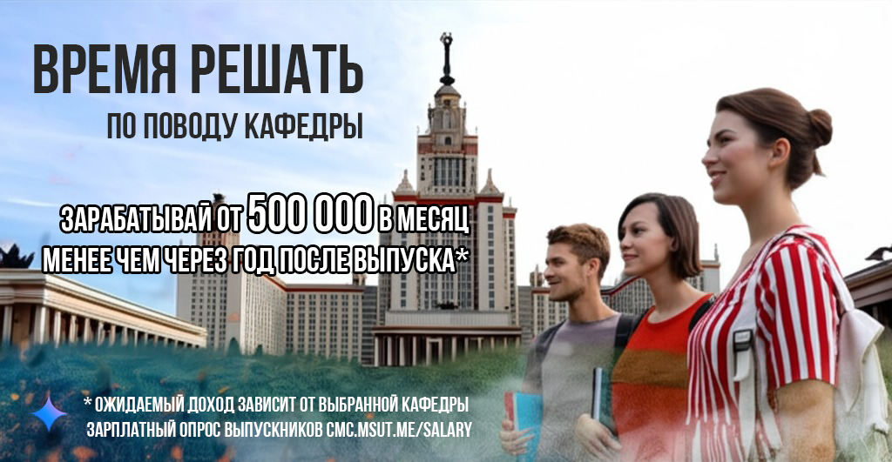
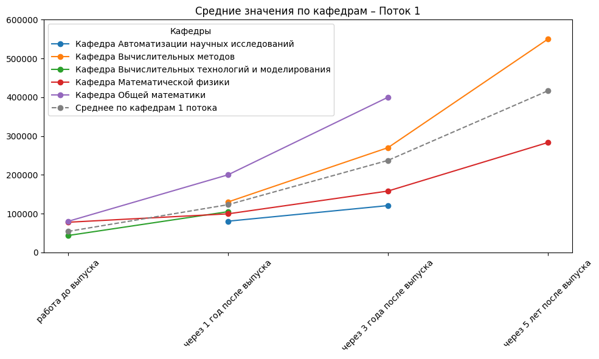
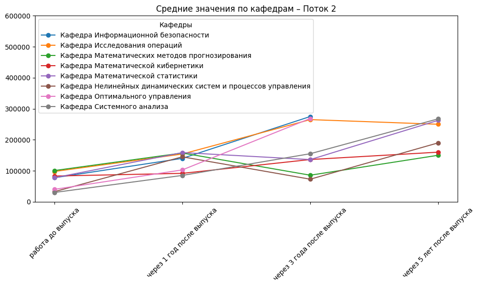
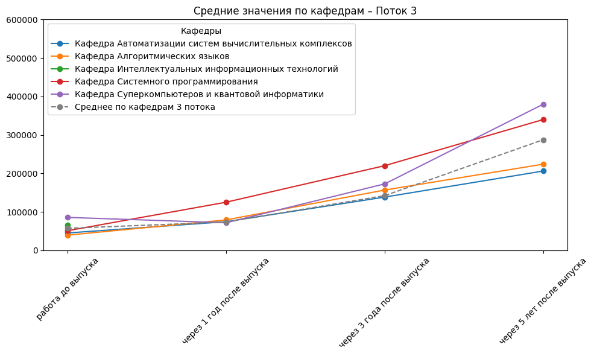
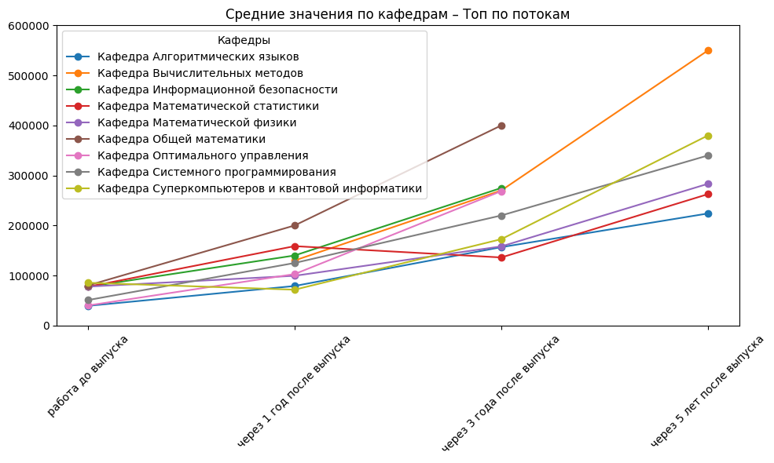

> 

### ✨ Цель и задача опроса

- Цель: развитие риск-менеджмента при выборе кафедры студентами 1 и 2 курсов
    - Риск: вероятность наступления события с негативными последствиями
        - Задача: определение корреляции между кафедрами и доходами выпускников

### ⚜️ Зарплатный опрос  

**Сервис для сбора данных**: [salary.msut.me](https://salary.msut.me)  

### 📝 Результаты опроса  

На текущий момент (01.04.2025) обработаны результаты опроса за 2022, 2023 и 2024 года

---

## Приятного развития ✌🏻
